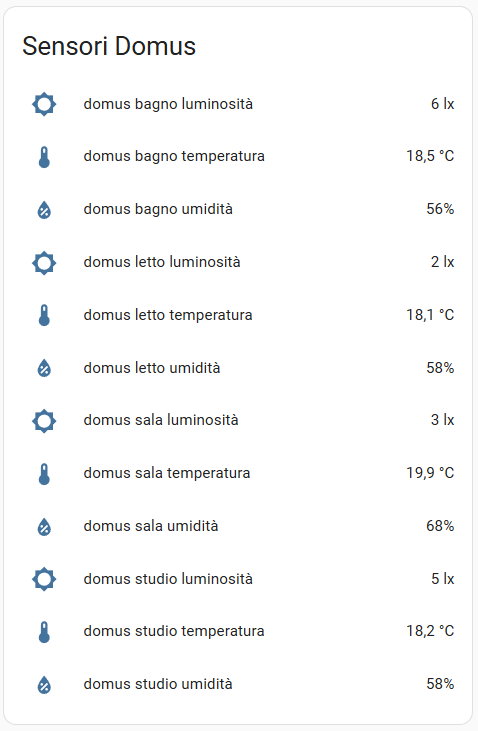
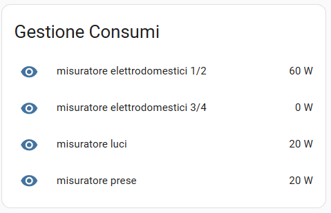
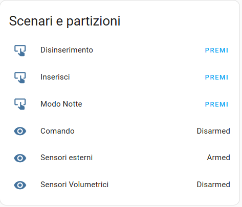

# Ksenia Connection Integration for Home Assistant

The **Ksenia Connection Integration** allows you to connect and manage your Ksenia devices directly within Home Assistant. This integration supports secure communication.


## Features
- Seamless connection to your Lares 4.0 unit.
- SSL support for secure communication.
- Supported components: outputs, zones, partitions, scenarios, powerlines.

## Screenshots
Here are some screenshots showcasing a basic use for the integration:

<details>
<summary>Click to expand screenshots</summary>
   







</details>


## Installation

### Manual Installation
1. Get in touch with the owner for repository permissions. (bennypadula@gmail.com)
2. Clone or download the repository.
3. Copy the `kseniaConnection` folder to the `custom_components` directory in your Home Assistant configuration folder.
4. Restart Home Assistant.

## Configuration

### Adding the Integration
1. Go to **Settings** → **Devices & Services** → **Add Integration**.
2. Search for "Ksenia Connection".
3. Enter the required details:
   - **Lares IP**: The IP address of your Ksenia device.
   - **PIN**: The PIN for authentication.
   - **Use SSL**: Enable this option if your device supports SSL.
4. Click **Submit** to test and save the connection.

### Modifying Settings
You can modify the integration settings without reinstalling:
1. Go to **Settings** → **Devices & Services**.
2. Find the "Ksenia Connection" integration and click **Configure**.
3. Update the desired settings:
   - **Lares IP**
   - **PIN**
   - **Use SSL**
4. Save the changes.

## Security

- This integration may lower the security of your alarm system. Please be aware of it!
- To establish communication it's necessary to provide an access PIN, DO NOT USE THE ADMINISTRATOR PIN, create an ad hoc user + dedicated pin.
- The Lares SSL certificate is self signed. For this reason, SSL Certificate authentication is disabled, this is vulnerable to man in the middle attacks (The same is true when accessing your Lares Ksenia 4.0 central from your PC/Browser!).

### Common Issues
- **Connection Failed**: Ensure that the IP address, PIN, and SSL setting are correct. Verify that your Ksenia device is reachable on the network.
- **SSL Errors**: If SSL is enabled, ensure the Ksenia device supports secure connections.
- **Library error**: be sure that [kseniaWebsocketLibrary](https://github.com/realnot16/kseniaWebsocketLibrary) is installed. If not, try ```pip install kseniaWebsocketLibrary```

### Logs
To enable debug logging, add the following to your `configuration.yaml`:

```yaml
logger:
  default: info
  logs:
    custom_components.kseniaConnection: debug
```

## License
This integration is licensed under a **commercial license**. Use of this software is subject to the terms and conditions

## Support

If you find this project useful, consider making a donation to support its development:

[](https://www.paypal.com/donate/?hosted_button_id=XXMMY7ZYEHWW4)
