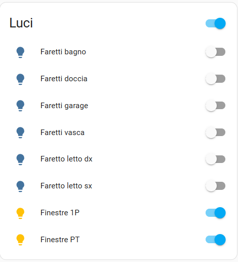

# Ksenia Connection Integration for Home Assistant

The **Ksenia Connection Integration** allows you to connect and manage your Ksenia devices directly within Home Assistant. This integration supports secure communication.


## Features
- Seamless connection to your Lares 4.0 unit.
- SSL support for secure communication.
- Supported components: outputs, zones, partitions, scenarios, powerlines and system info.

## Screenshots
Here are some screenshots showcasing a basic use for the integration:

<details>
<summary>Click to expand screenshots</summary>
   





</details>


## Installation

### Manual Installation
1. Get in touch with the owner for repository permissions. (benedetto.padula@gmail.com)
2. Clone or download the repository.
3. Copy the `kseniaConnection` folder to the `custom_components` directory in your Home Assistant configuration folder.
4. Restart Home Assistant.

## Configuration

### Adding the Integration
1. Go to **Settings** → **Devices & Services** → **Add Integration**.
2. Search for "Ksenia Connection".
3. Enter the required details:
   - **Lares IP**: The IP address of your Ksenia device.
   - **PIN**: The PIN for authentication.
   - **Use SSL**: Enable this option if your device supports SSL.
4. Click **Submit** to test and save the connection.

### Updating the library

The integration automatically checks for library updates and installs the latest available version. In case of errors, manually verify the installed version and update it if necessary.


**To update the kseniaWebsocketLibrary library to the latest available version, follow these steps:**

Access the Home Assistant container or the machine where Home Assistant is running

 Open a terminal and connect to the container by running:
```sh
docker exec -it ha-test sh
```

Run the following command to force the update while ignoring the pip cache:

```sh
pip install --upgrade --no-cache-dir kseniaWebsocketLibrary
```

After updating the library, *Restart Home Assistant*:


## Security

- This integration may lower the security of your alarm system. Please be aware of it!
- To establish communication it's necessary to provide an access PIN, DO NOT USE THE ADMINISTRATOR PIN, create an ad hoc user + dedicated pin.
- The Lares SSL certificate is self signed. For this reason, SSL Certificate authentication is disabled, this is vulnerable to man in the middle attacks (The same is true when accessing your Lares Ksenia 4.0 central from your PC/Browser!).

### Common Issues
- **Connection Failed**: Ensure that the IP address, PIN, and SSL setting are correct. Verify that your Ksenia device is reachable on the network.
- **SSL Errors**: If SSL is enabled, ensure the Ksenia device supports secure connections.
- **Library error**: be sure that [kseniaWebsocketLibrary](https://github.com/realnot16/kseniaWebsocketLibrary) is installed. If not, try ```pip install kseniaWebsocketLibrary```

### Logs
To enable debug logging, add the following to your `configuration.yaml`:

```yaml
logger:
  default: info
  logs:
    custom_components.kseniaConnection: debug
```

## Btcino Compatibility

### 📌 Library Modifications

**wscall.py**

Inside the `ws_login` function, modify the `"PAYLOAD_TYPE"` by replacing `"UNKNOWN"` with `"USER"`.

**websocketmanager.py**

For secure SSL connection, replace the existing SSL context configuration with the following:

```python
ssl_context = ssl.SSLContext(ssl.PROTOCOL_TLSv1_2)  # Force TLS 1.2
ssl_context.check_hostname = False                   # Disable hostname verification
ssl_context.verify_mode = ssl.CERT_NONE              # Ignore self-signed certificates
ssl_context.set_ciphers("AES128-SHA:DEFAULT@SECLEVEL=1")  # Match server's cipher suite
ssl_context.options |= ssl.OP_LEGACY_SERVER_CONNECT  # Allow insecure renegotiation
ssl_context.options |= ssl.OP_NO_TLSv1_3             # Disable TLS 1.3 (server uses TLS 1.2)
ssl_context.logging = True  # Enable SSL debug logs
```

### ⚙️ **Integration Modifications**

**manifest.json**

Replace the library link with the appropriately updated version.

**sensor.py**

Modify the partition state definitions.  
Specifically, for **Bticino 4200C**:

- `"Partition armed"` is **IA** (immediately armed) or **DA** (delayed armed).  
- The `"Disarmed"` state remains the same (**D, disarmed**).  
- The delay period before arming remains unchanged (**OT**).  


## License
This integration is licensed under a **commercial license**. Use of this software is subject to the terms and conditions

## Support

If you find this project useful, consider making a donation to support its development:

[](https://www.paypal.com/donate/?hosted_button_id=XXMMY7ZYEHWW4)
